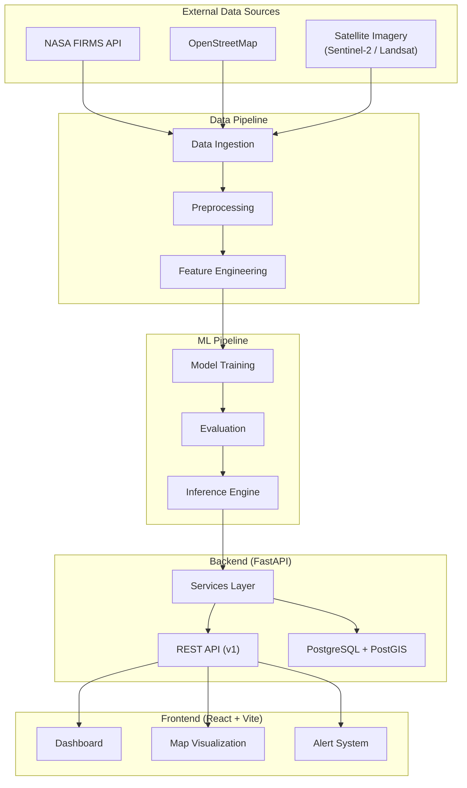

# SIH26162 — Industrial Fire & Thermal AI Detector

> **AI-Based Detection and Classification of Industrial Fires and Persistent Thermal Sources Using NASA FIRMS, OSM & Satellite Data**

[](https://www.sih.gov.in)
[](https://ntro.gov.in)
[](#)

---

## Problem Statement

**SIH26162** — AI-Based Detection and Classification of Industrial Fires and Persistent Thermal Sources Using NASA FIRMS, OSM & Satellite Data.

| Field         | Value                                      |
|---------------|---------------------------------------------|
| **Organization** | National Technical Research Organisation (NTRO) |
| **Category**     | Software                                    |
| **Event**        | Smart India Hackathon 2026                  |

---

## Project Objective

Build an **AI-powered system** that detects, classifies, and monitors industrial fires and persistent thermal anomalies by integrating:

- **NASA FIRMS** thermal anomaly data (active fire hotspots)
- **OpenStreetMap** land-use and infrastructure data
- **Satellite imagery** (Sentinel-2, Landsat-8/9)
- **Historical thermal observations** for pattern analysis

The system differentiates between various thermal source types — industrial furnaces, wildfires, controlled agricultural burns, power plants, and other persistent heat sources — providing classified, real-time alerts through an interactive dashboard.

---

## Problem Being Solved

Industrial fires cause **massive economic losses** (billions annually), **environmental damage**, and **loss of life**. Current detection systems suffer from:

1. **High false-positive rates** — cannot distinguish industrial heat from wildfires
2. **No contextual awareness** — ignore land-use data around thermal anomalies
3. **Delayed response** — lack real-time classification pipelines
4. **No historical pattern analysis** — miss persistent thermal sources (e.g., kilns, smelters)

This project uses AI + geospatial data to provide **accurate, classified, context-aware** fire and thermal source detection.

---

## Architecture Overview



---

## Technology Stack

| Layer        | Technology                                          |
|-------------|------------------------------------------------------|
| **Frontend**  | React 18, TypeScript, Vite, Tailwind CSS, shadcn/ui, Lucide Icons, React Router |
| **Backend**   | Python 3.11, FastAPI, SQLAlchemy, Pydantic, Uvicorn  |
| **Database**  | PostgreSQL 16 + PostGIS 3.4                          |
| **ML/AI**     | PyTorch, scikit-learn, GeoPandas, Rasterio           |
| **DevOps**    | Docker, Docker Compose                               |
| **Data Sources** | NASA FIRMS, OpenStreetMap, Sentinel-2, Landsat-8/9 |

---

## Project Structure

```
SIH26162/
├── backend/                    # FastAPI backend service
│   ├── app/
│   │   ├── main.py             # App entry point
│   │   ├── config.py           # Environment configuration
│   │   ├── api/v1/             # API v1 routes & schemas
│   │   ├── core/               # Database, security
│   │   ├── models/             # SQLAlchemy models
│   │   └── services/           # Business logic services
│   ├── requirements.txt
│   ├── Dockerfile
│   └── .env.example
├── frontend/                   # React + Vite frontend
│   ├── src/
│   │   ├── components/         # UI components
│   │   ├── pages/              # Page components
│   │   ├── hooks/              # Custom React hooks
│   │   ├── lib/                # Utilities & API client
│   │   └── types/              # TypeScript types
│   ├── package.json
│   └── .env.example
├── ml/                         # Machine learning pipeline
│   ├── preprocessing/          # Data preprocessing
│   ├── models/                 # Model definitions
│   ├── training/               # Training orchestration
│   ├── evaluation/             # Metrics & evaluation
│   ├── inference/              # Prediction pipeline
│   └── utils/                  # Geo & data utilities
├── data/
│   ├── raw/                    # Raw data (gitignored)
│   ├── processed/              # Processed data (gitignored)
│   └── sample/                 # Sample data & instructions
├── notebooks/                  # Jupyter notebooks
├── scripts/                    # Utility scripts
├── docs/                       # Documentation
├── tests/                      # Test suite
├── .gitignore
├── .env.example
├── docker-compose.yml
└── README.md
```

---

## Development Phases

| Phase | Description | Status |
|-------|-------------|--------|
| **Phase 0** | Project foundation & architecture | **Current** |
| **Phase 1** | Data pipeline — NASA FIRMS integration, preprocessing | Planned |
| **Phase 2** | ML model development — fire classification, thermal detection | Planned |
| **Phase 3** | Backend API — endpoints, database, services | Planned |
| **Phase 4** | Frontend dashboard — map visualization, real-time monitoring | Planned |
| **Phase 5** | Integration testing & optimization | Planned |
| **Phase 6** | Deployment, documentation & demo | Planned |

---

## Getting Started

### Prerequisites

- **Python 3.11+**
- **Node.js 18+** and **npm**
- **Docker & Docker Compose** (optional, for containerized setup)
- **PostgreSQL 16** with **PostGIS** extension (for later phases)

### Running the Backend

```bash
cd backend

# Create and activate virtual environment
python -m venv venv
venv\Scripts\activate          # Windows
# source venv/bin/activate     # macOS/Linux

# Install dependencies
pip install -r requirements.txt

# Configure environment
cp .env.example .env
# Edit .env with your settings

# Start the server
uvicorn app.main:app --reload --port 8000
```

The API will be available at `http://localhost:8000`

### Running the Frontend

```bash
cd frontend

# Install dependencies
npm install

# Configure environment
cp .env.example .env

# Start development server
npm run dev
```

The app will be available at `http://localhost:5173`

### Using Docker Compose

```bash
# Build and start all services
docker-compose up --build

# Stop all services
docker-compose down
```

---

## API Documentation

When the backend is running, interactive API docs are available at:

| Format     | URL                           |
|------------|-------------------------------|
| Swagger UI | http://localhost:8000/docs     |
| ReDoc      | http://localhost:8000/redoc    |

---

## Future Data Pipeline

The planned end-to-end data flow:

1. **NASA FIRMS API Ingestion** — Fetch active fire and thermal anomaly data (MODIS, VIIRS)
2. **OpenStreetMap Integration** — Retrieve land-use zones, industrial facilities, infrastructure
3. **Satellite Imagery Processing** — Download and process Sentinel-2 / Landsat tiles
4. **Feature Engineering** — Extract spatial, temporal, and spectral features
5. **ML Model Inference** — Classify thermal sources (industrial, wildfire, agricultural, etc.)
6. **Results Storage** — Store classified detections in PostGIS-enabled PostgreSQL
7. **API Serving** — Expose results via FastAPI REST endpoints
8. **Frontend Visualization** — Interactive map dashboard with alerts and analytics

---

## Team

> *Team details will be added here.*

---

## License

This project is developed for the Smart India Hackathon 2026.

MIT License — see [LICENSE](LICENSE) for details.
