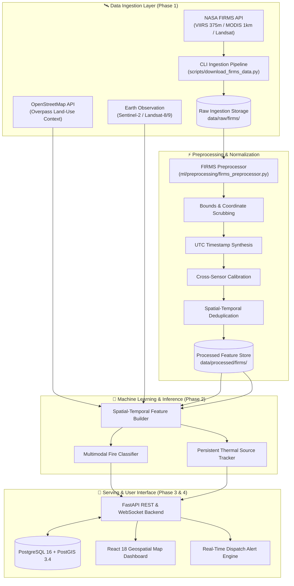

# 🔥 SIH26162 — AI-Based Detection & Classification of Industrial Fires and Persistent Thermal Sources

<div align="center">


<br/>

> **An apex-grade Geospatial AI intelligence system combining NASA FIRMS satellite thermal telemetry (VIIRS 375m & MODIS 1km), OpenStreetMap land-use spatial semantics, and multi-spectral Earth observation imagery to detect, classify, and track industrial fires, flare stacks, furnaces, and persistent thermal anomalies in real time.**

---

### 🌐 [Explore Documentation](docs/data_pipeline.md) • 🛰️ [NASA FIRMS Ingestion](scripts/download_firms_data.py) • ⚡ [FastAPI Backend](backend) • 📊 [React UI](frontend)

---

</div>

## 📌 Executive Summary

Industrial fires, uncontrolled flare emissions, and unmonitored thermal anomalies cause **billions of dollars in critical infrastructure damage**, catastrophic environmental degradation, and loss of life annually. Conventional monitoring systems fail because:

1. ❌ **High False Alarm Rates**: Unable to distinguish between routine industrial combustion (furnaces, steel kilns) and dangerous uncontrolled fires.
2. ❌ **Lack of Spatial Context**: Thermal hotspots from satellites are isolated dots without surrounding land-use intelligence.
3. ❌ **No Temporal Persistence Tracking**: Cannot discern transient agricultural crop burns from permanent industrial thermal signatures.
4. ❌ **High Detection Latency**: Lack automated real-time ingestion and ML inference pipelines.

**SIH26162** overcomes these challenges by fusing **real-time satellite thermal sensors** with **geospatial context graphs** and **multimodal deep learning models** to deliver categorized, actionable alerts.

---

## 🏛️ System Architecture



---

## 🛠️ Complete Technology Stack

| Layer | Primary Technologies | Capabilities |
|---|---|---|
| **Satellite & Telemetry** | `NASA FIRMS REST API`, `VIIRS (SNPP/NOAA-20/21)`, `MODIS`, `Landsat-8/9` | 375m & 1km active fire thermal anomalies, Brightness Temperature (Kelvin), Fire Radiative Power (MW) |
| **Geospatial & Spatial Context** | `OpenStreetMap Overpass API`, `GeoPandas`, `Shapely`, `PyProj`, `Rasterio` | Industrial land-use boundaries, buffer analysis, infrastructure distance matrices |
| **Backend & Microservices** | `FastAPI`, `Uvicorn`, `Pydantic V2`, `SQLAlchemy 2.0`, `AsyncPG`, `HTTPX` | High-throughput asynchronous endpoints, rate-limited resilient retry clients |
| **Database & GIS** | `PostgreSQL 16`, `PostGIS 3.4`, `GeoAlchemy2` | Spatial indexing (R-Tree / GiST), spatial polygons, time-series historical thermal telemetry |
| **Machine Learning & AI** | `PyTorch`, `scikit-learn`, `NumPy`, `Pandas`, `XGBoost` | Multiclass thermal classification, temporal persistence clustering, anomaly detection |
| **Frontend & Analytics** | `React 18`, `TypeScript`, `Vite`, `Tailwind CSS`, `MapLibre GL / Leaflet`, `Lucide Icons` | Real-time interactive spatial map, heatmaps, thermal source breakdown, live alerts |
| **DevOps & Testing** | `Docker`, `Docker Compose`, `Pytest`, `AnyIO` | Containerized microservices, deterministic test fixtures, reproducible execution |

---

## 📂 Repository Directory Layout

```
SIH26162/
├── 📁 backend/                       # FastAPI High-Performance Backend Service
│   ├── 📁 app/
│   │   ├── 📄 main.py                # Application entrypoint & middleware configuration
│   │   ├── 📄 config.py              # Pydantic environment configuration (.env loaded)
│   │   ├── 📁 api/v1/                # Version 1 API endpoints & response schemas
│   │   ├── 📁 core/                  # Database connections, security, & lifecycle hooks
│   │   ├── 📁 models/                # SQLAlchemy & GeoAlchemy2 PostGIS database models
│   │   └── 📁 services/              # Business logic (FIRMSService, OSMService, etc.)
│   ├── 📄 requirements.txt           # Backend dependencies
│   └── 📄 Dockerfile                 # Backend container definition
│
├── 📁 frontend/                      # Modern React 18 + Vite Web Dashboard
│   ├── 📁 src/
│   │   ├── 📁 components/            # UI components (Map views, Stat cards, Filter bars)
│   │   ├── 📁 pages/                 # Full dashboard pages & analytical views
│   │   ├── 📁 hooks/                 # Custom React stateful hooks
│   │   └── 📁 lib/                   # API clients, spatial utilities, color tokens
│   ├── 📄 package.json               # Node.js dependencies
│   └── 📄 Dockerfile                 # Frontend container definition
│
├── 📁 ml/                            # Machine Learning & Geospatial Processing
│   ├── 📁 preprocessing/             # FIRMS preprocessor, coordinate sanitizers, cleaners
│   ├── 📁 models/                    # Classifier architectures & thermal cluster models
│   ├── 📁 training/                  # Model training orchestration & hyperparameter tuning
│   ├── 📁 inference/                 # Real-time inference pipelines
│   └── 📁 utils/                     # Geo-computation and spatial math utilities
│
├── 📁 data/                          # Data Storage Layers (Git-Protected)
│   ├── 📁 raw/firms/                 # Raw NASA FIRMS CSV telemetry downloads
│   ├── 📁 processed/firms/           # Cleaned, normalized, and deduplicated datasets
│   └── 📁 sample/                    # Verified test samples & verification fixtures
│
├── 📁 scripts/                       # CLI Automations & Data Ingestion Tools
│   ├── 📄 download_firms_data.py     # Production NASA FIRMS downloader & preprocessor
│   └── 📄 setup_database.py          # PostGIS schema and spatial extension initializer
│
├── 📁 tests/                         # Comprehensive Unit & Integration Test Suite
│   ├── 📁 backend/                   # API & service mock integration tests
│   └── 📁 ml/                        # Preprocessing, schema, & coordinate validation tests
│
├── 📁 docs/                          # In-Depth Engineering & Architectural Documentation
│   ├── 📄 data_pipeline.md           # End-to-end data flow specifications
│   ├── 📄 architecture.md            # System design & component interactions
│   └── 📄 api_specification.md       # OpenAPI endpoints & contract schemas
│
├── 📄 pytest.ini                     # Pytest environment configuration
├── 📄 docker-compose.yml             # Full-stack Docker orchestration
├── 📄 .env.example                   # Environment variable template
└── 📄 README.md                      # Project master guide
```

---

## 🚦 Roadmap & Phase Milestones

| Phase | Milestone Name | Status | Key Deliverables |
|:---:|---|:---:|---|
| **Phase 0** | Foundation & Architecture |  | Directory layout, FastAPI skeleton, Docker Compose, PostGIS schema scaffolding |
| **Phase 1** | Real NASA FIRMS Data Ingestion |  | Resilient FIRMS API client, coordinate sanitizer, UTC synthesizer, CLI downloader |
| **Phase 2** | Machine Learning & Classification |  | Feature engineering, OSM Overpass enrichment, PyTorch thermal anomaly classifier |
| **Phase 3** | Backend Services & Database CRUD |  | PostGIS spatial queries, active fire feeds, alerts API, auth & RBAC |
| **Phase 4** | Interactive Frontend Dashboard |  | MapLibre/Leaflet heatmaps, classification overlays, live telemetry charts |
| **Phase 5** | End-to-End Testing & Optimization |  | Performance benchmarking, load testing, precision/recall spatial validation |
| **Phase 6** | Deployment & Hackathon Demo |  | Production cloud staging, presentation deck, automated CI/CD pipeline |

---

## 🚀 Quickstart Guide

### 1. Clone & Configure Environment

```bash
git clone https://github.com/AyushPrad2907/AI-Based-Detection-and-Classification-of-Industrial-Fires-and-Persistent-Thermal-Sources.git
cd AI-Based-Detection-and-Classification-of-Industrial-Fires-and-Persistent-Thermal-Sources/SIH26162

# Create your .env file
cp .env.example .env
```

Add your free [NASA FIRMS MAP_KEY](https://firms.modaps.eosdis.nasa.gov/api/area/) inside `.env`:
```dotenv
FIRMS_API_KEY=your_32_character_nasa_firms_key_here
```

### 2. Run Data Ingestion & Preprocessing (Phase 1)

```bash
# Download 1 day of real VIIRS active fires for India
python scripts/download_firms_data.py --country IND --days 1 --source VIIRS_SNPP_NRT

# Download and preprocess in one command
python scripts/download_firms_data.py --country IND --days 1 --preprocess --min-confidence nominal

# Download custom geographic bounding box (min_lon, min_lat, max_lon, max_lat)
python scripts/download_firms_data.py --bbox 68.0,6.0,97.0,37.0 --days 2 --preprocess
```

### 3. Run Automated Tests

```bash
# Execute full backend and ML preprocessor test suite
python -m pytest -v
```

---

## 🧪 Test Verification Matrix

| Component Tested | Test Module | Coverage & Checks | Status |
|---|---|---|:---:|
| **FIRMS Service Client** | `tests/backend/test_firms_service.py` | API key auth, coordinate boundaries, days 1-10, URL generation, key masking, rate limit (429) & error handling |  |
| **FIRMS Preprocessor** | `tests/ml/test_firms_preprocessor.py` | Schema validation, coordinate range cleaning, UTC timestamp synthesis, sensor normalization, deduplication |  |
| **FastAPI Core & Health** | `tests/test_health.py` & `tests/backend/test_api.py` | Health probe `/api/v1/health/`, root endpoint, placeholder router status |  |

---

## 📜 License & Acknowledgments

- **License**: Released under the **MIT License**. See [`LICENSE`](LICENSE) for terms.
- **Problem Statement**: **SIH26162** — Smart India Hackathon 2026.
- **Organization**: National Technical Research Organisation (**NTRO**).
- **Data Acknowledgments**: NASA Earthdata FIRMS Team & OpenStreetMap contributors.

<div align="center">

**Built with precision and purpose for Smart India Hackathon 2026** 🚀

</div>
