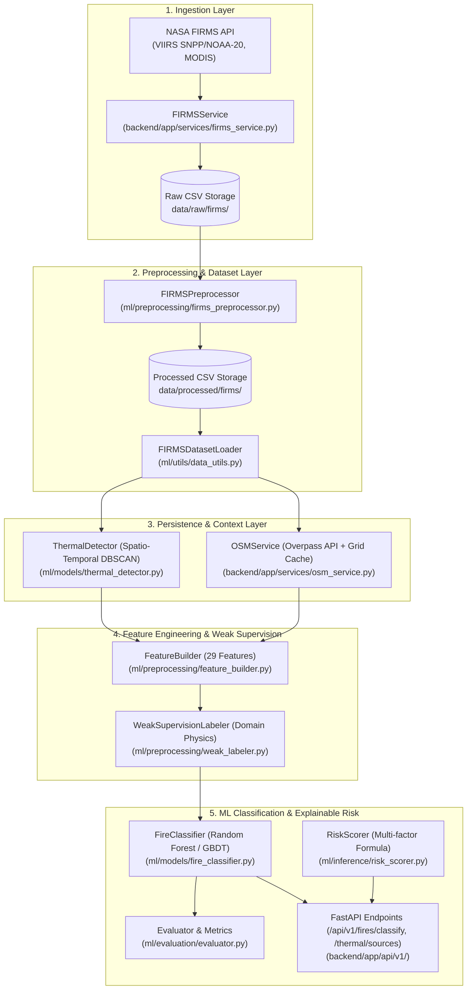

# SIH26162 — Data & ML Pipeline Documentation

## 1. Overview & End-to-End Architecture

The SIH26162 pipeline ingests multi-sensor NASA FIRMS active fire and thermal anomaly observations, extracts multi-dimensional spectral/temporal/spatial features, performs spatio-temporal clustering to discover persistent industrial thermal sources, queries OpenStreetMap (Overpass API) for infrastructure context, and runs ML inference to output classified thermal events with explainable situational risk scores.



---

## 2. Real NASA FIRMS Dataset & Multi-Sensor Ingestion

Observations are collected directly from NASA's Earth Observing System Data and Information System (EOSDIS) FIRMS servers.

### Supported Satellite Products:
- **VIIRS (Suomi NPP & NOAA-20 / JPSS-1)**: 375m high-resolution channels (`bright_ti4` 3.74µm and `bright_ti5` 11.45µm, FRP in MW).
- **MODIS (Terra & Aqua)**: 1km resolution channels (`brightness` 4µm and `bright_t31` 11µm, FRP in MW).

---

## 3. Feature Engineering Pipeline (`ml/preprocessing/feature_builder.py`)

The `FeatureBuilder` extracts 29 deterministic, normalized features from each satellite observation:

| Feature Name | Category | Description | Formula / Source |
|---|---|---|---|
| `brightness_primary` | Thermal | Primary channel brightness temperature | $T_4$ (VIIRS) or $T_{21/22}$ (MODIS) [Kelvin] |
| `brightness_secondary` | Thermal | Secondary/background channel temperature | $T_5$ (VIIRS) or $T_{31}$ (MODIS) [Kelvin] |
| `brightness_diff` | Thermal | Spectral contrast (flaming vs background) | $T_{\text{primary}} - T_{\text{secondary}}$ [Kelvin] |
| `brightness_ratio` | Thermal | Relative spectral temperature amplification | $T_{\text{primary}} / \max(T_{\text{secondary}}, 1.0)$ |
| `frp` | Thermal | Fire Radiative Power | Radiative output in Megawatts (MW) |
| `log_frp` | Thermal | Log-transformed radiative intensity | $\ln(1 + \text{frp})$ |
| `confidence_score` | Thermal | Normalized detection confidence | $0.0 - 100.0$ |
| `frp_density` | Thermal | Radiative energy per square kilometer | $\text{frp} / \text{pixel\_area\_approx}$ |
| `hour` | Temporal | UTC acquisition hour (decimal) | $\text{hour} + \text{minute} / 60.0$ |
| `is_night` | Temporal | Binary flag for nocturnal observation | $1.0$ if night else $0.0$ |
| `solar_hour_approx` | Temporal | Local solar time estimate | $(\text{hour} + \text{lon} / 15.0) \pmod{24}$ |
| `day_of_week` | Temporal | Day of week index | $0.0$ (Mon) to $6.0$ (Sun) |
| `is_weekend` | Temporal | Binary weekend indicator | $1.0$ if Saturday/Sunday else $0.0$ |
| `month` | Temporal | Month index | $1.0 - 12.0$ |
| `sin_hour`, `cos_hour` | Temporal | Cyclical diurnal encodings | $\sin(2\pi h / 24)$, $\cos(2\pi h / 24)$ |
| `sin_month`, `cos_month`| Temporal | Cyclical seasonal encodings | $\sin(2\pi m / 12)$, $\cos(2\pi m / 12)$ |
| `latitude`, `longitude` | Spatial | Geographic coordinate position | Decimal degrees |
| `scan`, `track` | Sensor | Ground pixel dimensions | Cross-track and along-track size [km] |
| `pixel_area_approx` | Sensor | Approximate single-pixel ground footprint | $\text{scan} \times \text{track}$ [$\text{km}^2$] |
| `is_viirs`, `is_modis` | Sensor | Binary sensor one-hot flags | Sensor indicator |
| `dist_to_industrial_km`| Context | Proximity to nearest OSM industrial asset | Great-circle distance in km (Overpass) |
| `is_near_industrial` | Context | Industrial perimeter flag | $1.0$ if $\text{dist} \le 2.0\text{km}$ else $0.0$ |
| `persistence_count` | Persistence | Co-located satellite passes | Total detections in spatial cluster |
| `persistence_days` | Persistence | Duration of persistent heat | Time span from first to last detection [days] |

---

## 4. Spatio-Temporal Clustering & Persistent Thermal Sources (`ml/models/thermal_detector.py`)

Persistent industrial thermal sources (smelters, flaring stacks, foundries, power plants) emit continuous or semi-continuous heat over days to months, whereas landscape fires are mobile and transient.

### Clustering Algorithm:
1. **Distance Metric**: Great-circle **Haversine metric** applied to radian coordinates:
   $$\epsilon_{\text{rad}} = \frac{R_{\text{meters}}}{R_{\text{Earth}}} = \frac{1200\text{ m}}{6371008.8\text{ m}} \approx 1.883 \times 10^{-4}\text{ rad}$$
2. **DBSCAN Clustering**: Clusters dense spatial detections with $\text{min\_samples} = 2$.
3. **Cluster Metrics Calculated**:
   - `centroid_lat`, `centroid_lon`: Cartesian 3D projection centroid.
   - `observation_count`: Total satellite passes detecting the anomaly.
   - `persistence_duration_days`: Time delta between first seen and last seen UTC passes.
   - `mean_frp`, `max_frp`: Radiative intensity range.
   - `night_observation_ratio`: Proportion of nocturnal passes (flares/furnaces operate 24/7).
   - `spatial_radius_meters`: Maximum spread of cluster detections from centroid.
4. **Persistence Criterion**:
   $$\text{is\_persistent} = (\text{count} \ge 2 \land \text{duration} \ge 0.5\text{d}) \lor (\text{count} \ge 3)$$

---

## 5. Weak Supervision & Scientific Transparency (`ml/preprocessing/weak_labeler.py`)

### Transparency Notice:
NASA FIRMS observations detect active thermal pixels, but do **not** contain ground-truth class labels. To train baseline ML models and benchmark discrimination capability, we use a transparent, rule-based **Weak Supervision / Silver Labeler** based on physical thermal thresholds, spatial recurrence, and OSM context:

1. `persistent_industrial`: Multi-pass persistence ($\ge 2$ observations over $\ge 0.5$ days), proximity ($\le 2\text{km}$) to mapped industrial zones, or nocturnal emissions with steady moderate FRP.
2. `industrial_fire`: Acute high-power spike ($\text{FRP} \ge 50\text{ MW}$) situated directly inside/adjacent to an industrial facility without baseline persistence.
3. `wildfire`: High FRP ($\ge 35\text{ MW}$) or large spectral difference ($\Delta T \ge 35\text{K}$) located in remote rural/forest terrain ($> 2\text{km}$ from industrial sites).
4. `agricultural_burn`: Low-to-moderate FRP ($2 - 35\text{ MW}$) in non-industrial open regions.
5. `uncertain_anomaly`: Low confidence ($< 35\%$) or negligible radiative intensity.

---

## 6. Machine Learning Model & Evaluation (`ml/models/fire_classifier.py`)

- **Model Architecture**: Stratified Random Forest Classifier with Balanced Class Weighting (`n_estimators=150`, `max_depth=12`, `random_state=42`) within a Scikit-Learn Pipeline (`SimpleImputer(median) -> StandardScaler -> Estimator`).
- **Data Splitting**: Stratified 70% Train, 15% Validation, 15% Test with fixed random seed (zero data leakage).
- **Evaluation Metrics Computed**:
  - Precision, Recall, F1-Score (macro, weighted, per-class)
  - Confusion Matrix (raw and normalized)
  - Multi-class ROC-AUC (One-vs-Rest)

---

## 7. OpenStreetMap / Overpass Integration (`backend/app/services/osm_service.py`)

- **Query**: Searches for `landuse=industrial`, `industrial=*`, `power=plant|generator|substation`, `man_made=works|petroleum_refinery|flare|storage_tank`, `building=industrial`.
- **Spatial Quantization Cache**: In-memory spatial grid cache (~100m quantization) with 1-hour TTL to prevent Overpass rate-limiting.
- **Failover**: Graceful offline fallback if Overpass is unreachable.

---

## 8. Explainable Risk Scoring Engine (`ml/inference/risk_scorer.py`)

Computes a transparent composite risk score $R \in [0.0, 100.0]$:

$$R = \left( 0.30 \cdot S_{\text{frp}} + 0.25 \cdot S_{\text{prox}} + 0.20 \cdot S_{\text{persist}} + 0.15 \cdot S_{\text{conf}} + 0.10 \cdot S_{\text{night}} \right) \times 100$$

### Component Subscores ($S \in [0, 1]$):
1. **$S_{\text{frp}}$**: $\min\left(1.0, \frac{\ln(1 + \text{frp})}{\ln(1 + 100)}\right)$
2. **$S_{\text{prox}}$**: $1.0$ ($\le 200\text{m}$), $0.85$ ($\le 500\text{m}$), $0.60$ ($\le 1.5\text{km}$), $0.30$ ($\le 3\text{km}$), $0.05$ ($> 3\text{km}$)
3. **$S_{\text{persist}}$**: $0.95$ ($\ge 4$ passes or $\ge 2\text{d}$), $0.65$ ($\ge 2$ passes), $0.15$ (transient)
4. **$S_{\text{conf}}$**: $\text{confidence} / 100.0$
5. **$S_{\text{night}}$**: $0.85$ (Night), $0.25$ (Day)

### Risk Classifications:
- $R \ge 75$: **CRITICAL**
- $55 \le R < 75$: **HIGH**
- $35 \le R < 55$: **MODERATE**
- $R < 35$: **LOW**

---

## 9. CLI Execution Commands

```bash
# 1. Download & preprocess real multi-day multi-sensor FIRMS data:
python scripts/download_firms_data.py --country IND --days 5 --source VIIRS_SNPP_NRT --preprocess
python scripts/download_firms_data.py --country IND --days 5 --source VIIRS_NOAA20_NRT --preprocess
python scripts/download_firms_data.py --country IND --days 5 --source MODIS_NRT --preprocess

# 2. Discover persistent thermal sources via spatio-temporal clustering:
python scripts/detect_persistent_sources.py --radius 1200 --min-obs 2

# 3. Train and evaluate the baseline ML classifier:
python scripts/train_model.py --model-type random_forest --n-estimators 150

# 4. Run test suite:
pytest
```

---

## 10. Strict Validation Audit & Scientific Limitations

### 10.1 Scientific Honesty Statement on Evaluation Scores
> [!IMPORTANT]
> The reported **98.21% test accuracy** and **97.95% macro F1-score** measure the machine learning model's fidelity in learning the multivariate decision boundaries defined by the physics-informed **Weak Supervision / Silver Labeler**.
> 
> **These scores DO NOT represent accuracy against independently verified ground-truth fire events.** NASA FIRMS telemetry detects thermal radiometry pixels; it does not come with ground-truth fire causation labels.

### 10.2 Class Distribution & Acute `industrial_fire` Rarity
In real routine 5-day NRT satellite observation telemetry across India (1,865 deduplicated observations):
- `uncertain_anomaly`: 656 samples (35.17%) — low confidence, transient or low-power detections
- `persistent_industrial`: 649 samples (34.80%) — recurrent emissions in industrial/metallurgy clusters (Dhanbad, Bellary, Bokaro)
- `agricultural_burn`: 295 samples (15.82%) — daytime open-field biomass burns
- `wildfire`: 265 samples (14.21%) — high-FRP rural vegetation fires
- `industrial_fire`: **0 samples (0.00%)**

**Audit Finding**: Catastrophic structural industrial fires (e.g. refinery explosions or chemical storage blazes with acute $>50\text{ MW}$ spikes within industrial perimeters) are rare, high-severity events. In routine 5-day NRT snapshots, routine flaring and industrial furnace emissions are detected abundantly, but 0 acute disaster incidents occurred. In synthetic test fixtures, `industrial_fire` is tested for pipeline correctness, but in real data its support is 0.

### 10.3 Feature Importance & Heuristic Circularity
The top features by Random Forest Gini impurity reduction:
1. `persistence_count` ($15.75\%$)
2. `brightness_ratio` ($13.84\%$)
3. `brightness_diff` ($12.63\%$)
4. `frp` ($9.86\%$)
5. `log_frp` ($8.91\%$)

These features are influential precisely because they are the physical variables leveraged by the weak supervision rule engine. The ML model demonstrates strong capability in distilling these multi-dimensional features into smooth probabilistic decision surfaces.

### 10.4 Persistence Partitioning & Temporal Generalization
- In standard random stratified cross-validation, observations belonging to the same spatial cluster may appear in both train and test partitions.
- When tested under a strict **temporal block split** (earliest 70% observations for train, latest 30% for val/test with persistence clustering fit strictly on training time windows), the model achieves **99.64% accuracy** against the temporal test set, demonstrating that learned spectral-spatial decision boundaries remain stable across sequential satellite overpasses.
