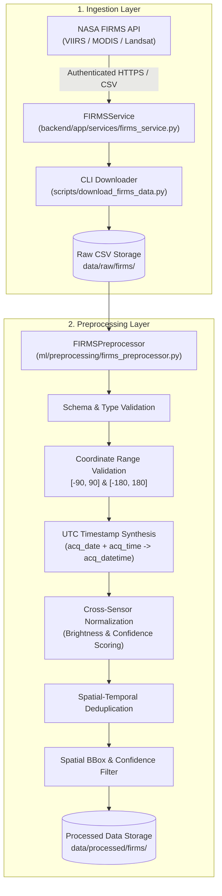

# SIH26162 — Data Pipeline Documentation

## 1. Overview & Data Flow Architecture

The data pipeline transforms real-time and archival Earth observation thermal anomaly data into structured, clean, context-enriched geospatial records ready for machine learning feature engineering and industrial classification.



---

## 2. NASA FIRMS Data Ingestion (Phase 1)

### 2.1 Supported Satellite Instruments & Sources

| Source Identifier | Sensor & Satellite | Spatial Resolution | Processing Mode |
|---|---|---|---|
| `VIIRS_SNPP_NRT` | VIIRS on Suomi-NPP | 375 m | Near Real-Time (NRT) |
| `VIIRS_NOAA20_NRT` | VIIRS on NOAA-20 (JPSS-1) | 375 m | Near Real-Time (NRT) |
| `VIIRS_NOAA21_NRT` | VIIRS on NOAA-21 (JPSS-2) | 375 m | Near Real-Time (NRT) |
| `MODIS_NRT` | MODIS on Terra & Aqua | 1 km | Near Real-Time (NRT) |
| `VIIRS_SNPP_SP` | VIIRS on Suomi-NPP | 375 m | Standard Processing (SP) |
| `MODIS_SP` | MODIS on Terra & Aqua | 1 km | Standard Processing (SP) |
| `LANDSAT_NRT` | TIRS on Landsat 8/9 | 30 m | Near Real-Time (NRT) |

### 2.2 Configuration & Environment Variables

All secrets and endpoints are managed via environment variables (never hardcoded):

| Variable | Type | Default | Description |
|---|---|---|---|
| `FIRMS_API_KEY` | `string` | *(Required)* | 32-character NASA FIRMS MAP_KEY |
| `FIRMS_BASE_URL` | `string` | `https://firms.modaps.eosdis.nasa.gov` | FIRMS API Base URL |
| `FIRMS_TIMEOUT_SECONDS` | `float` | `30.0` | HTTP request timeout in seconds |
| `FIRMS_MAX_RETRIES` | `integer` | `3` | Max retry attempts for transient errors |
| `FIRMS_RETRY_BACKOFF_FACTOR` | `float` | `1.5` | Exponential backoff multiplier |
| `FIRMS_DEFAULT_SOURCE` | `string` | `VIIRS_SNPP_NRT` | Default satellite product |
| `FIRMS_DEFAULT_COUNTRY` | `string` | `IND` | Default ISO country code |

*Get a free NASA FIRMS MAP_KEY at: [https://firms.modaps.eosdis.nasa.gov/api/area/](https://firms.modaps.eosdis.nasa.gov/api/area/)*

### 2.3 Raw Storage Layout

Downloaded raw observations are stored under `data/raw/firms/` with deterministic naming:
```
data/raw/firms/firms_<SOURCE>_<TARGET>_<YYYYMMDD_HHMMSS>.csv
```

---

## 3. Data Preprocessing Pipeline

The preprocessing pipeline (`ml/preprocessing/firms_preprocessor.py`) standardizes diverse sensor outputs into a consistent schema.

### 3.1 Preprocessing Transformations

1. **Schema & Column Name Validation**: Ensures `latitude`, `longitude`, `acq_date`, and `acq_time` are present. Strips whitespace and normalizes column headers to lowercase snake_case.
2. **Geographic Coordinate Validation**: Validates that latitude is within `[-90.0, 90.0]` and longitude within `[-180.0, 180.0]`. Drops corrupt or non-numeric entries.
3. **UTC Timestamp Synthesis**:
   - Converts 1-to-4 digit UTC `acq_time` integers/strings (`730` -> `07:30`, `1430` -> `14:30`) and merges with `acq_date`.
   - Produces standard `acq_datetime` (`YYYY-MM-DD HH:MM:SS` UTC).
4. **Cross-Sensor Normalization**:
   - **Brightness**: Harmonizes primary brightness (`bright_ti4` for VIIRS, `brightness` for MODIS) into `brightness_primary` and secondary brightness (`bright_ti5` for VIIRS, `bright_t31` for MODIS) into `brightness_secondary`.
   - **Fire Radiative Power**: Normalizes `frp` (in Megawatts) as non-negative float.
   - **Confidence Scoring**: Maps VIIRS categorical flags (`l` -> 30, `n` -> 70, `h` -> 100) and MODIS percentages (`0-100`) into standardized `confidence_score` (numeric float) and `confidence_category` (`low`, `nominal`, `high`).
   - **Metadata Preservation**: Retains all raw sensor columns (`scan`, `track`, `satellite`, `instrument`, `version`, `daynight`).
5. **Exact Spatial-Temporal Deduplication**: Drops duplicate records matching `(latitude, longitude, acq_datetime, satellite, instrument)`.
6. **Filtering**: Supports optional filtering by minimum confidence (`low`, `nominal`, `high` or numeric threshold) and geographic bounding box `[min_lon, min_lat, max_lon, max_lat]`.
7. **Deterministic Ordering**: Sorts cleaned records by `[acq_datetime, latitude, longitude]`.

### 3.2 Processed Storage Layout

Cleaned and normalized datasets are saved under `data/processed/firms/`:
```
data/processed/firms/firms_<SOURCE>_<TARGET>_<YYYYMMDD_HHMMSS>_processed.csv
```

---

## 4. Running the Ingestion & Preprocessing CLI

### 4.1 Download Active Fires for India (VIIRS 375m)
```bash
python scripts/download_firms_data.py --country IND --days 1 --source VIIRS_SNPP_NRT
```

### 4.2 Download & Preprocess in One Step
```bash
python scripts/download_firms_data.py --country IND --days 1 --preprocess --min-confidence nominal
```

### 4.3 Download Using a Custom Bounding Box (West, South, East, North)
```bash
python scripts/download_firms_data.py --bbox 68.0,6.0,97.0,37.0 --days 2 --preprocess
```

### 4.4 Using a Specific Historical Date
```bash
python scripts/download_firms_data.py --country IND --days 1 --date 2024-05-01 --source MODIS_NRT --preprocess
```

---

## 5. Next Stages (Future Phases)

- **Stage 2: Context Enrichment (OSM)**: Ingest industrial land-use zones and facility perimeters via Overpass API.
- **Stage 3: Satellite Spectral Processing**: Sentinel-2 / Landsat-8/9 multi-spectral band processing and SWIR/NIR indices.
- **Stage 4: Feature Engineering**: Combine spatial, temporal, land-use, and spectral metrics into ML feature vectors.
- **Stage 5: ML Inference**: Classify detections into industrial furnace, flare stack, wildfire, or agricultural burn.
- **Stage 6: PostGIS Storage & Serving**: Expose classified thermal sources via FastAPI REST endpoints and interactive UI.
